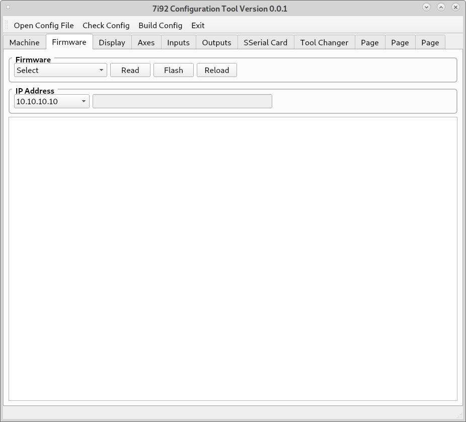

Firmware
========

Flashing Firmware
^^^^^^^^^^^^^^^^^

In `Firmware Tab` you can view and change the 7i92 firmware. Before using the
`Firmware` buttons you must select the IP Address in the `Board Setup Group`.
The 7i92 must be connected to the PC, 5vdc power supplied and jumpered for
the address selected.

* **Read** Reads the current firmware and displays it in the output window. If
  sucessful then you have the 7i92 configured and connected correctly.

* **Flash** After selecting the firmware the `Flash` button will write the new
  firmware to the 7i92.

* **Reload** After flashing you must either `Reload` or power cycle the 7i92.

* **Copy** Copies the contents of the output window to the clipboard. Then you
  can paste the output to a file for later use.
